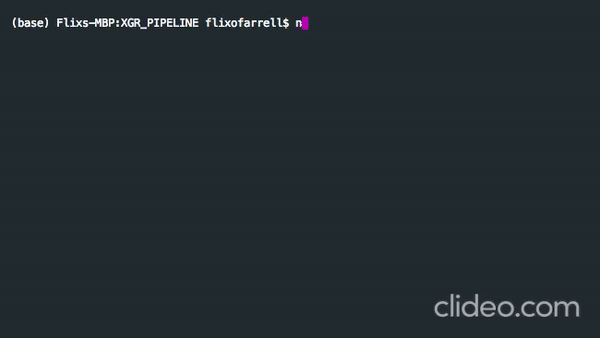

# XGR Pipeline in Nextflow

## Overview
Automated downstream pipeline to wrangle EBI-summary statistics and perform subnetwork and enrichment analysis on lead SNPs

The pipeline performs the following:
   * Wrangle EBI-summary statistic files 
   * Hunt down close genes to each lead SNP
   * Perform subnetwork analysis on close genes 
   * Store the subnetwork in edge and vertices files
   * Perform basic enrichment analysis with the nodes from the subnetwork

Author: Felix O'Farrell
Date: April 2020

## Installation

## Dependencies 

Download Nextflow either through anaconda

```bash
conda install -c bioconda nextflow
conda install -c bioconda/label/cf201901 nextflow
```

Or use curl to download the package into your current directory

```bash
curl -s https://get.nextflow.io | bash
```

and clone this repository onto your machine

```bash
git clone https://github.com/flixofarrell/XGR_PIPELINE.git
```

## Usage
Run with local test files 

```bash
nextflow run XGR_PIPELINE
```
or 

```bash
./nextflow run XGR_PIPELINE
```





Downlaod summary statistics from GWAS catalog [here](https://www.ebi.ac.uk/gwas/downloads/summary-statistics).

add path to summary statistics to bash command (this will overwrite the test file)

```bash
nextflow run XGR_PIPELINE.nf --sum_data path/to/your/summary/statistics
```
or 
```bash
./nextflow run XGR_PIPELINE.nf --sum_data path/to/your/summary/statistics
```

## Parameters
### --sum_data - dir of GWAS summary file
### --nsig - significance cut-off for subnetwork construction
### --ncol - colour scheme         
### --etest - enrichment test
### --stype - statistical test for enrichment
### --outdir - out-directory 


## Contributing
Pull requests are welcome. For major changes, please open an issue first to discuss what you would like to change.

Please make sure to update tests as appropriate.

## License
[MIT](https://choosealicense.com/licenses/mit/)